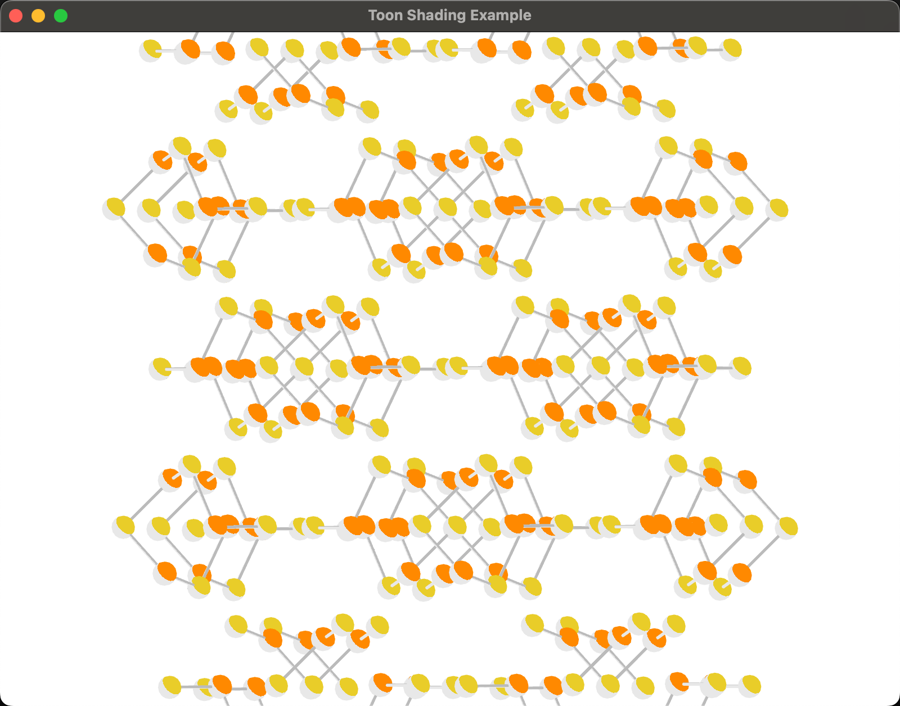

# simple-molecule-renderer

Simple molecule render implementing toon shading.

## Preview



## Dependencies

- OpenGL
- GLFW
- GLEW
- GLM

For MacOS users

```Bash
brew install glfw3
brew install glew
brew install glm
```

For Ubuntu users

```Bash
sudo apt-get install libglfw3-dev libglew-dev libglm-dev
```

## Build

```Bash
mkdir build/
cd build
cmake ..
make
cd ..
ln -s build/ToonShading .
./ToonShading
```
