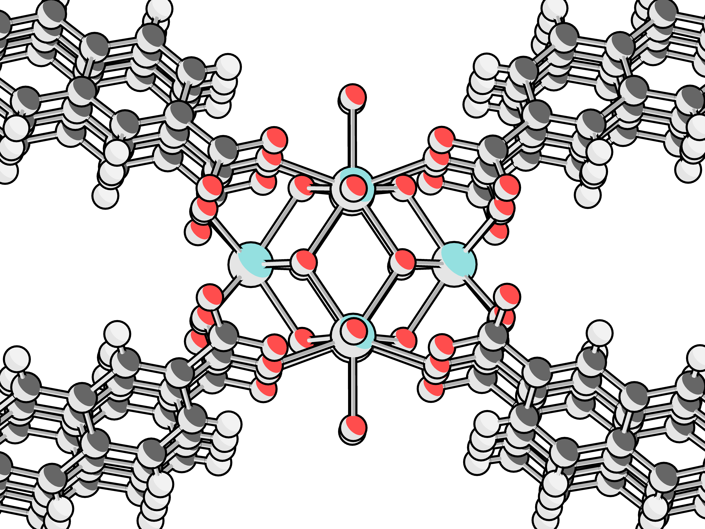

# simple-molecule-renderer

Simple molecule renderer implementing toon shading.

## Preview



## Dependencies

- OpenGL
- GLFW
- GLEW
- GLM

For MacOS users

```Bash
brew install glfw3
brew install glew
brew install glm
```

For Ubuntu users

```Bash
sudo apt-get install libglfw3-dev libglew-dev libglm-dev
```

## Build

```Bash
mkdir build/
cd build
cmake ..
make
cd ..
ln -s build/ToonShading .
./ToonShading
```

## Basic usages

- W/A/S/D/Q/E for moving camera translationally
- dragging with left mouse key for rotating your model.
- ctrl+s for exporting image(4x current resolution, enough for publishing)

You could simply replacing the `.xyz` file path in `main.cpp` with your own `xyz` file path.

## Acknowledgements

Thanks for the graphical library: [stb](https://github.com/nothings/stb).
